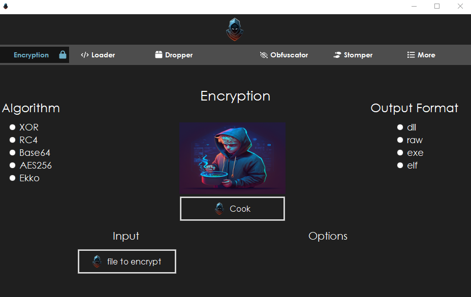

# Panicware Suite

This repository contains C# projects that are designed to work together to provide a full payload encryption and deployment system.

Features:
1. Encryptions - This function provides a simple way to encrypt any code (not just shellcode) using a XOR/RC4/AES/ekko sleep obfuscation. The resulting output can be passed to the Shellcodeloader project for deployment.

2. Shellcodeloader - This function provides a set of functions that can be used to deploy encrypted shellcode in memory. It contains functions such as VirtualAlloc, Marshal.Copy, and Marshal.GetDelegateForFunctionPointer to decrypt and allocate the encrypted code in memory and then execute it.

3. PanicDrop - This function is a loader that can load an assembly from an encoded or encrypted file via a remote URL. It is designed to be a dropper for payloads.

## Encryptions
The Encryptions project provides a simple way to encrypt any code (not just shellcode) using an algorithm of your choice for encryption. The resulting output can be passed to the Shellcodeloader project for deployment.

### How to Use
- Clone the repository and open the solution file in Visual Studio.
- Build the solution to generate the executable.
- Use the simple GUI to make your moves.
- The output will be created on your chosen directory.

## ShellcodeloaderGui (Work in progress)
Graphical User Interface for that will wrap the whole process together in a nice neet way that will be fun and easy to use.

## TODO
For encryption: 
- [x] Create a button to choose a file from directory.
- [ ] Read chosen file contents and pass them for encryption.
- [ ] Make encryption algorithms (RC4,AES,EKKO sleep obf).
- [ ] Fix buttons to choose encryption algorithm to work.

For shellcodeloader:
- [ ] Give different choices of loading the payload.

Extra:
- [ ] Experiment with techniques (Dll sideloads, clickonce, appdomain injections)

### Note
These projects are for educational purposes only and should not be used for any malicious activities.